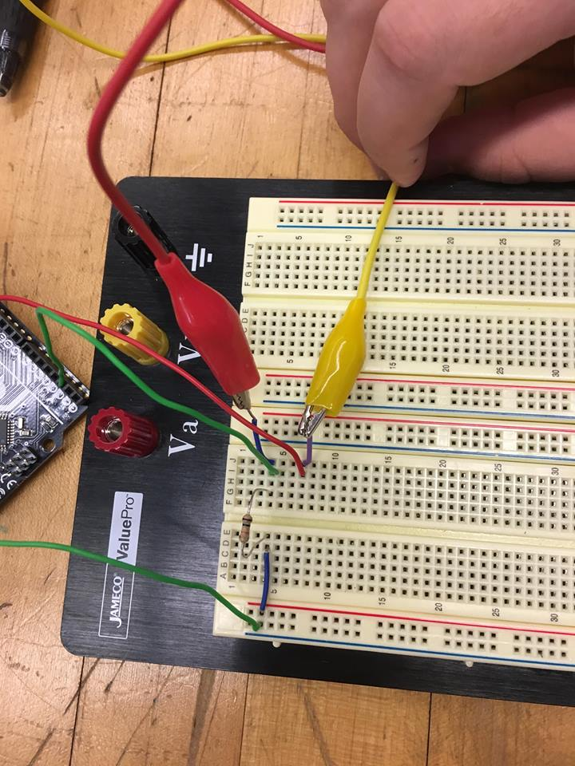
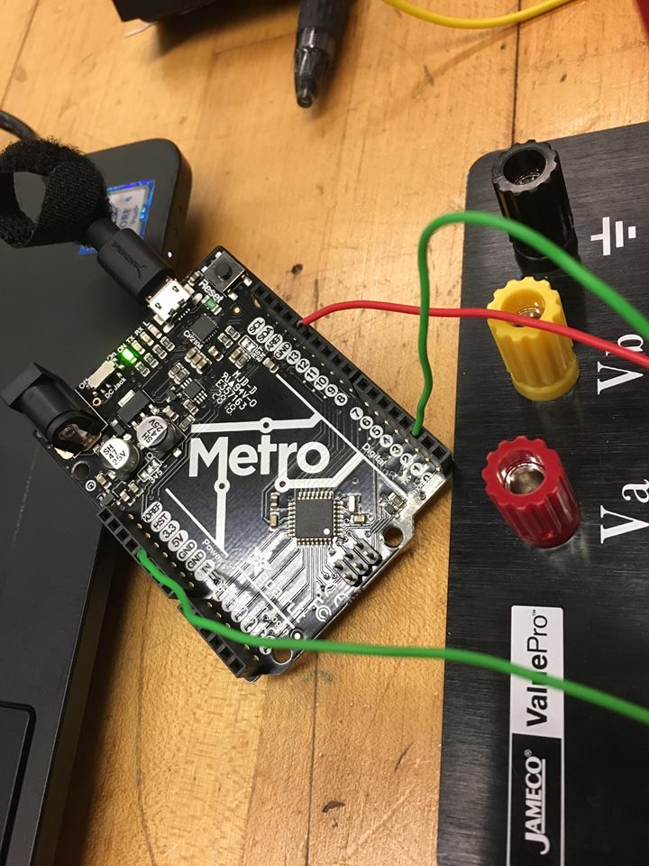
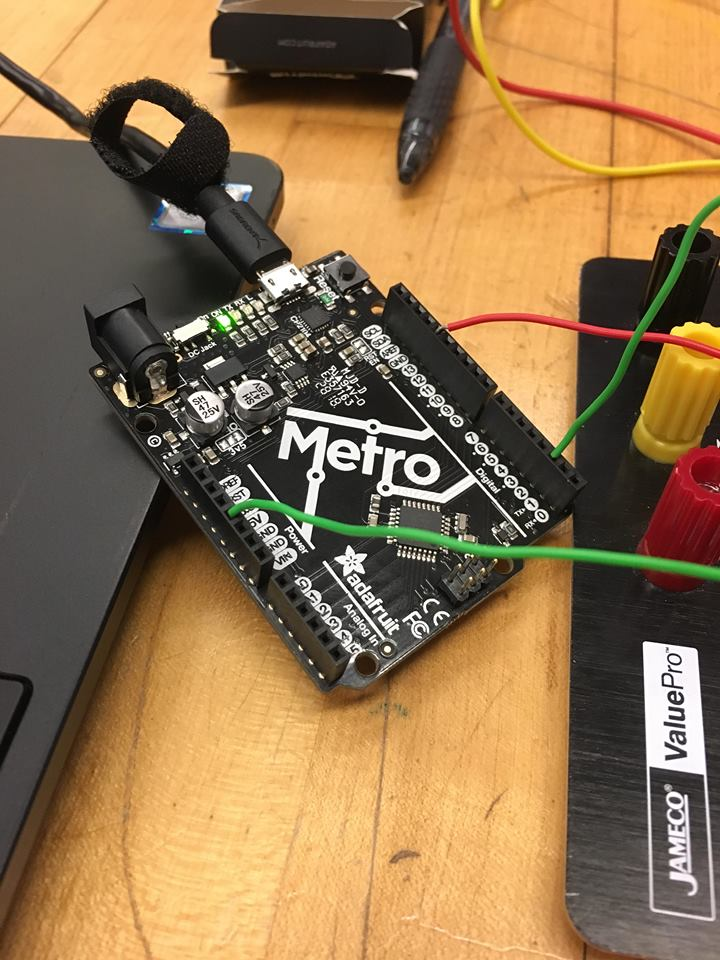
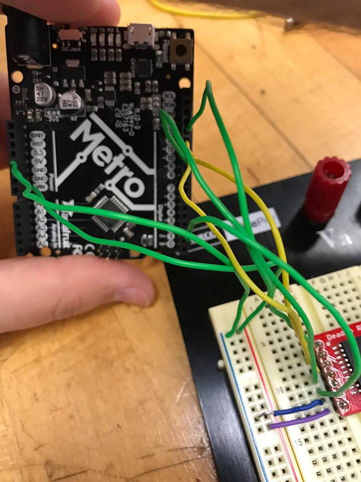
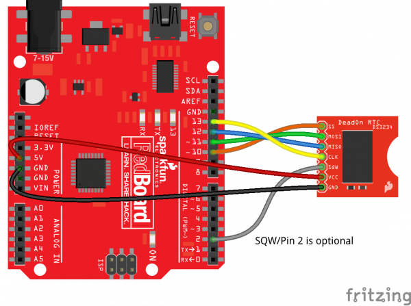

# P00: Scott Pagan: Jacob and Logan

**Author(s)**: Jacob Beckman and Logan Owens

**Google Document**: https://docs.google.com/document/d/1hsyco2lYED1d21zSUrluGJs95nO4BOk33x6JR7TQmBE/edit?usp=sharing

---
# Purpose
This product will solve the issue of not waking up due to getting used to an alarm. Very often you will just have one alarm tone and after a long time your brain may get used to hearing it and so it will no longer surprise you or wake you up. This product will instead require more activity to snooze it and thus better waking the user. It will accomlish this by playing a loud noise from speakers that can only be turned off by furiosly shaking the product.

# Initial Design Plan
- The product will have at least one speaker but possibly more. 
- It will use the accelerometer to detect input from the user.
- Possibly a wifi connection, if that is possible.
- Code will include:
  - A function to check if the accelerometer has exceeded a preset threshold to turn off the speakers.
  - A function that determines what time it is based on either information from maybe WiFi or a preset internal clock, possibly a combination of both.
  - A function that plays a tone.
  Revisions:
  - Instead of an accelerometer we are instead using a flip switch to keep track of how many times the device is shaken.
  - We are also using a realtime clock module to manage the time and set alarms.
  - We intend to use the real time clock and flip switch to control the buzzer we will be using for the alarm.
 
 # Images

 
 
 
 
 
 
 
  
# Files
- Images Folder
- License
- README.MD
- example-README.MD
- Jacob_and_Logan Guide to Computer Necromancy Vol. 1.ino (main project file-will be renamed at a later date)

# References
- Arduino IDE 
- Stack Overflow: Will probably be used in the future
- Berea College
- SparkFun DS3234 Real-Time Clock Packages - https://learn.sparkfun.com/tutorials/deadon-rtc-breakout-hookup-guide/all
- Arduino IDE Example: Digital Debouncer - https://learn.adafruit.com/tilt-sensor/using-a-tilt-sensor

# Summary

You'll complete this part at the end of the project.

Provide a brief summary description of the design and implementation, including how much your initial design plan evolved, the final result you achieved and the amount of time you spent as a programmer in accomplishing these results, including any challenges overcome and innovations that were not specifically required by the assignment. This section should be no more than three paragraphs.
Instructions

Explain how to use your product. This section should THOROUGHLY describe its usage (i.e., more than just "Push start").
Errors and Constraints

You'll complete this part at the end of the project.

Every program has bugs. Use this section to create a bullet list of all known errors and deficiencies that remain in your product. Also, list any constraints that must exist for your product to work (e.g., Only works in low light situations).
Reflection

You'll complete this part at the end of the project.

Write 2 - 4 paragraphs on your reactions to the final project. Your reflection should be thoughtful and reflective. It is NOT a report about WHAT you did. Instead, it's a look back at what you learned by doing this project. It should be critical of shortcomings (yours, as well as the instructors/assignments) as well as celebratory of what was achieved.

# Final Self-Evaluations

Partner 1 (replace this with your name): 0-10

Partner 2 (replace this with your name): 0-10
Code creation:

Partner 1 (replace this with your name): 0-10

Partner 2 (replace this with your name): 0-10
Documentation creation:

Partner 1 (replace this with your name): 0-10

Partner 2 (replace this with your name): 0-10
Teamwork & Participation:

Partner 1 (replace this with your name): 0-10

Partner 2 (replace this with your name): 0-10
